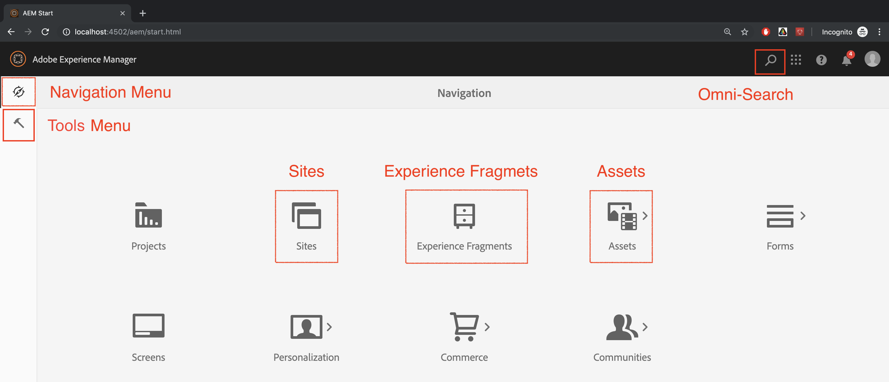

# Integrating Adobe Experience Manager with Adobe Target {#integrating-aem-target-options}

In this section, we will discuss how to set up Adobe Experience Manager with Adobe Target for different use cases. Based on your use case and organizational requirements, you can choose either one of the options, or both.

* **Option 1 - Using Launch, By Adobe via Adobe I/O Console**
    If your site is hosted on AEM, you can add Target libraries to your site pages using Adobe's Tag Management system, [Launch](https://docs.adobe.com/content/help/en/launch/using/overview.html) (*formerly known as DTM*). Launch provides a simple way to deploy and manage all tags necessary to power relevant customer experiences.
* **Option 2 - Using AEM legacy Cloud Services**
    For AEM customers, who would like to use Experience Fragment offers to create an activity within Adobe Target, you might need to integrate Adobe Target with AEM using the Legacy Cloud Services. This integration is required to push Experience Fragments from AEM to Target as HTML/JSON offers and to keep the target offers in sync with AEM. *This integration is required for implementing Use Case 1.*

## Prerequisites

* **[AEM](#aem)**
  * AEM 6.5 (*recommend installing the Latest Service Pack*)
  * Download AEM WKND reference site packages
    * [aem-guides-wknd.ui.apps-0.0.1-SNAPSHOT.zip](https://github.com/adobe/aem-guides-wknd/releases/download/archetype-18.1/aem-guides-wknd.ui.apps-0.0.1-SNAPSHOT.zip)
    * [aem-guides-wknd.ui.content-0.0.1-SNAPSHOT.zip](https://github.com/adobe/aem-guides-wknd/releases/download/archetype-18.1/aem-guides-wknd.ui.content-0.0.1-SNAPSHOT.zip)
    * [Core Components](https://github.com/adobe/aem-core-wcm-components/releases/download/core.wcm.components.reactor-2.5.0/core.wcm.components.all-2.5.0.zip)
    * [Digital Data Layer](assets/implementation/digital-data-layer.zip)

* **Experience Cloud**
  * Access to your organizations Adobe Experience Cloud - <https://>`<yourcompany>`.experiencecloud.adobe.com
  * Experience Cloud provisioned with the following solutions
    * [Launch, By Adobe](https://marketing.adobe.com)
    * [Adobe Target](https://marketing.adobe.com)
    * [Adobe I/O Console](https://console.adobe.io)

* **Environment**
  * Java 1.8 or Java 11 (AEM 6.5+ only)
  * Apache Maven (3.3.9 or newer)
  * Chrome

>[!NOTE]
>
> Customer needs to be properly provisioned with Adobe Launch and Adobe I/O from [Adobe support](https://helpx.adobe.com/contact/enterprise-support.ec.html) or reach out to your system administrator

### Getting your AEM Instance ready {#getting-aem}

AEM author and publish instance is necessary to complete this tutorial. We have the author instance running on localhost:4502 and publish instance running on localhost:4503.

When we refer to a local AEM instance, we are talking about a copy of Adobe Experience Manager that is running on a developer’s personal machine. All AEM development should start by writing and running code against a local AEM instance.

If you are new to AEM, there are two basic run modes can be installed: Author and Publish. The Author runmode is the environment that digital marketers will use to create and manage content. When developing 90% of the time you will be deploying code to an Author instance. This allows you to create new pages as well as add and configure components. AEM Sites is a WYSIWYG authoring CMS and therefore most of the CSS and JavaScript can be tested against an authoring instance.

It is also critical test code against a local Publish instance. The Publish instance is the AEM environment that visitors to your website will interact with. While the Publish instance is the same technology stack as the Author instance, there are some major distinctions with configurations and permissions. Code should always be tested against a local Publish instance before being promoted to higher level environments.

#### Set up author and publish instance

For more information see: [Set up a Local AEM Development Environment](https://helpx.adobe.com/experience-manager/kt/platform-repository/using/local-aem-dev-environment-article-setup.html).

1. Get a copy of the [AEM Quickstart Jar and a license](https://helpx.adobe.com/experience-manager/6-5/sites/deploying/using/deploy.html#GettingtheSoftware)
2. Create a folder structure on your computer like the following:
    
3. Rename the Quickstart jar to aem-author-p4502.jar and place it beneath the /author directory. Add the license.properties file beneath the /author directory.
    
4. Make a copy of the Quickstart jar, rename it to aem-publish-p4503.jar and place it beneath the /publish directory. Add a copy of the license.properties file beneath the /publish directory.
    
5. Double click the **aem-author-p4502.jar** file to install the Author instance. This will start the author instance, running on port 4502 on the local computer.
6. Sign In using the credentials below, and upon successful login, you will be directed to the AEM Home Page Screen
   username : **admin**
   password : **admin**
    
7. Double click the aem-publish-p4503.jar file to install a publish instance. This will start a publish instance, running on port 4503 on the local computer and displaying the WeRetail home page. We will be using the WKND reference site for this tutorial and let's install the packages on author instance.
8. From your AEM Home Page, navigate to *[Tools > Deployment > Packages](http://localhost:4502/crx/packmgr/index.jsp)*
9. Download and Upload the packages for AEM (listed above under *[Prerequisites > AEM](#aem)*)
    * [aem-guides-wknd.ui.apps-0.0.1-SNAPSHOT.zip](https://github.com/adobe/aem-guides-wknd/releases/download/archetype-18.1/aem-guides-wknd.ui.apps-0.0.1-SNAPSHOT.zip)
    * [aem-guides-wknd.ui.content-0.0.1-SNAPSHOT.zip](https://github.com/adobe/aem-guides-wknd/releases/download/archetype-18.1/aem-guides-wknd.ui.content-0.0.1-SNAPSHOT.zip)
    * [core.wcm.components.all-2.5.0.zip](https://github.com/adobe/aem-core-wcm-components/releases/download/core.wcm.components.reactor-2.5.0/core.wcm.components.all-2.5.0.zip)
    * [digital-data-layer.zip](assets/implementation/digital-data-layer.zip)

    >[!VIDEO](https://video.tv.adobe.com/v/28377t1)
10. At this point, you have successfully installed your WKND reference site and all additional packages required for this tutorial.

[NEXT CHAPTER](./using-launch-adobe-io.md): In the next chapter, you will be integrating Launch with AEM.
