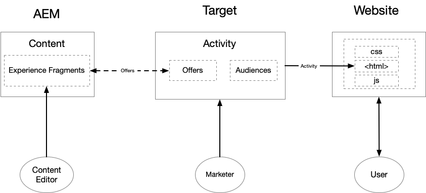

# Getting Started with AEM and Adobe Target {#getting-started-with-aem-target}

AEM and Target are both powerful solutions with seemingly overlapping capabilities. Customers sometimes struggle with questions like: 1. When should I use Target to personalize content vs AEM? 2. How do internal teams working with these different solutions collaborate in order to personalize effectively ?, etc.

In this tutorial, we cover three different use cases for AEM and Target, which helps you understand what works best for your organization and how different teams collaborate.

* Use Case 1 : Personalization using AEM Experience Fragments
* Use Case 2 : Home Page Redesign and Redirects
* Use Case 3 : Personalization using Visual Experience Composer

## Personalization using AEM Experience Fragments {#personalization-using-aem-experience-fragment}

For this scenario, we are going to use AEM and Target. Clearly, both the products has its own advantages and when it comes to delivering personalized experience to your site users, you need 2 things: 1) personalized content for your site 2) an intelligent way to serve these content based on a specific user.

AEM can help you with creating your personalized content. AEM brings together all of your content and assets in a central location to fuel your personalization strategy. AEM lets you easily create content for desktops, tablets, and mobile devices in one place without writing code. There’s no need to create pages for every device—AEM automatically adjusts each experience using your content. You can also export the content from AEM to Adobe Target with push of a button.

We now have personalized content from AEM in Target, and how to deliver this personalized content to your site users? Target lets you deliver personalized experiences at scale based on a combination of rules-based and AI-driven machine learning approaches that incorporate behavioral, contextual, and offline variables.  With Target, you can easily set up and run A/B and Multivariate (MVT) activities to determine the best offers, content, and experiences.

**Experience fragments** represent a huge step forward to link the content/experience creators to the personalization professionals who are driving business outcomes using Target.

* AEM content editor authors personalized content as Experience Fragments and its variations
* AEM exports Experience Fragment markup to Target​
* Target​ uses AEM Experience Fragment markup as offers in activities
* Target delivers Experience Fragment markup, AEM provides referenced images

    

## Personalization using Visual Experience Composer

Marketers can make quick changes on their website without changing any code to run a test using Adobe Targets Visual Experience Composer.The VEC is WYSIWYG (What you see is what you get) user interface that lets you easily create and test personalized experiences and offers in the site context. You can create experiences and offers for Target activities by dragging and dropping, swapping, and modifying the layout and content of a web page (or offer) or mobile web page.

VEC is one of the main features of Adobe Target. The VEC lets marketers and designers create and change content using a visual interface. Many design choices can be made without requiring direct editing of the code. Editing HTML and JavaScript is also possible using the editing options available in the composer.

* Content resides in AEM, and content editors create and manage the site pages
* Target​ uses AEM hosted site pages to run tests and personalization
* Target delivers personalized content
* Net new content is created using Adobe Targets VEC
* Applies to both AEM hosted sites and non-AEM hosted sites

    

## Home Page Redesign and Redirects {#homepage-redesign-redirects}

Integrating Adobe Experience Manager with Adobe Target helps you deliver a personalized experience to your site users. Additionally, it also helps you better understand what versions of your website content best improve your conversions during a pre-specified test period. For example, An A/B test compares two or more versions of your Website content to see which best lifts your conversions, sales, or other metrics you identify. A marketer can create activities within Adobe Target to understand how users interact with your site's content and how it affects your site metrics.

* Content resides in AEM, and content editors create and manage the site pages
* Target​ uses AEM hosted site pages to run tests and personalization
* Target delivers personalized content
* No net new content is created here
* Applies to both AEM hosted sites and non-AEM hosted sites

    