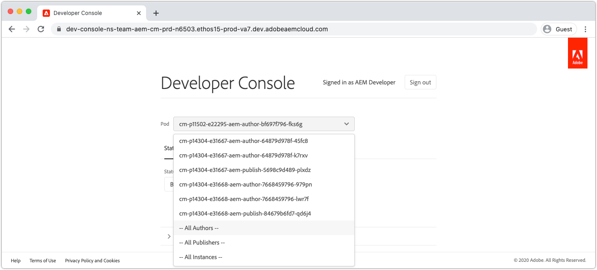

AEM as a Cloud Service provides a Developer Console for each environment that exposes various details of the running AEM service that are helpful in debugging.

Each AEM as a Cloud Service environment has it's own Developer Console.

## Developer Console access

To access the Developer Console, the user must be a member of the Adobe Organization's Cloud Manager's "Developer - Cloud Service" Product Profile, managed via the [Adobe Admin Console](https://adminconsole.adobe.com).

[!VIDEO]()

## Pod

 The Pod selection defines the scope of data that will exposed via the other controls in the Developer console. 

+ A pod is a discrete AEM runtime instance that is part of an AEM Service (Author or Publish)
+ Only pods that are part of the selected AEM as a Cloud Service environment, are listed that environment's Developer Console's Pod switcher.
+ At the bottom of the Pod switcher, there are convenience options for selecting Pods by type:
    + All Authors
    + All Publishers
    + All Instances

## Status

The Status provides options for outputting specific AEM runtime state in text or JSON output. The Developer Console provides much of the same information as is available in the AEM SDK's local quickstart's OSGi Web console, with the marked difference that this information is read-only.

### Bundles

Bundles lists all OSGi bundles in AEM. This functionality is similar to [AEM SDK's local quickstart's OSGi Bundles](http://localhost:4502/system/console/bundles) at `/system/console/bundles`.

Bundles help in debugging by:

+ Listing all OSGi bundles deployed to AEM
+ Listing each OSGi bundle's state; including if they are active or not
+ Providing details into unresolved dependencies that cause OSGi bundles from becoming active

### Components

Components lists all the OSGi components in AEM. This functionality is similar to [AEM SDK's local quickstart's OSGi Components](http://localhost:4502/system/console/components) at `/system/console/components`.

Component help in debugging by:

+ Listing all OSGi components deployed to AEM
+ Providing each OSGi component's state; including if they are active or unsatisfied
+ Providing details into unsatisfied service references may cause OSGi components from becoming active
+ Listing OSGi properties and their values bound to the OSGi component

### Configurations

Configurations lists all the OSGi component's configurations (OSGi properties and values). This functionality is similar to [AEM SDK's local quickstart's OSGi Configuration Manager](http://localhost:4502/system/console/configMgr) at `/system/console/configMgr`.

Configurations help in debugging by:

+ Listing OSGi properties and their values by OSGi component

### Oak Indexes

Oak Indexes provide a dump of the nodes defined beneath `/oak:index`. Keep in mind this does not show merged indexes, which occurs when an AEM index is modified.

Oak Indexes help in debugging by:

+ Listing all Oak Index definitions to help understand how search queries are executed in AEM. Keep in mind, that modified to AEM indexes are not reflected here. This view is only helpful for indexes that are solely provided by AEM, or solely provided by the custom code.

### OSGi Services

Components lists all the OSGi services. This functionality is similar to [AEM SDK's local quickstart's OSGi Services](http://localhost:4502/system/console/services) at `/system/console/services`.

OSGi Services help in debugging by:

+ Listing all OSGi services in AEM, along with its providing OSGi bundle, and all OSGi bundles that consume it

### Sling Jobs

Sling Jobs lists all the OSGi services. This functionality is similar to [AEM SDK's local quickstart's Jobs](http://localhost:4502/system/console/slingevent) at `/system/console/slingevent`.

Sling Job help in debugging by:

+ Providing a list of all OSGi services in AEM, along with its providing OSGi bundle, and all OSGi bundles that consume it

## Java Packages

Java Packages allows checking if a Java package, and version, are available for use in AEM as a Cloud Service. This functionality is the same as [AEM SDK's local quickstart's Dependency Finder](http://localhost:4502/system/console/depfinder) at `/system/console/depfinder`.

Java Packages is used to trouble shoot Bundles not be starting because of unresolved imports, or unresolved classes in scripts (HTL, JSP, etc). If Java Packages reports no bundles export a Java package (or the version does not match that imported by an OSGi bundle):

+ Ensure your project's AEM API maven dependency's version matches the environment's AEM Release version (and if possible, update everything to the latest).
+ If extra Maven dependencies are used in the Maven project
    + Determine if an alternative API provided by the AEM SDK API dependency can be used instead.
    + If the extra dependency is required, ensure it's provide as an OSGi bundle (rather than a plain Jar) and it is embedded in your project's code package, (`ui.apps`), similar to how the core OSGi Bundle is embedded in the `ui.apps` package.

## Servlets

Servlets is used to provide insight as to how AEM resolves a URL to a Java servlet or script (HTL, JSP) that ultimately handles the request. This functionality is the same as [AEM SDK's local quickstart's Sling Servlet Resolver](http://localhost:4502/system/console/servletresolver) at `/system/console/servletresolver`.

Servlets helps in debugging determining: 

+ How a URL is decomposed into its addressable parts (resource, selector, extension).
+ What servlet or script a URL resolves to, helping identify mal-formed URLs or mis-registered servlets/scripts.

## Queries

Queries help provide insights into what and how search queries are executed on AEM. This functionality is the same as  [AEM SDK's local quickstart's Tools > Query Performance ](http://localhost:4502/libs/granite/operations/content/diagnosistools/queryPerformance.html) console. 

Queries only works when a specific pod is selected, as it opens that pod's Query Performance web console.

Queries helps in debugging by: 

+ Explaining how queries are interpreted, analyzed and executed by Oak. This is very important when tracking why a query is slow, and understanding how it can be sped up.
+ Listing the most popular queries running in AEM, with the ability to Explain them.
+ Listing the slowest queries running in AEM, with the ability to Explain them.

