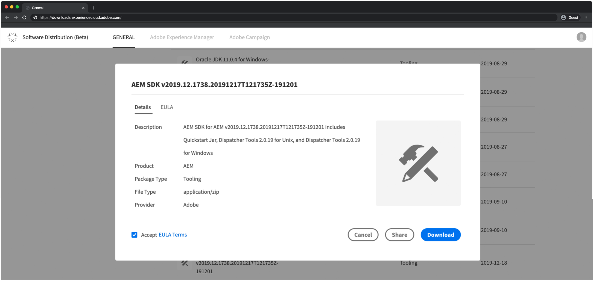
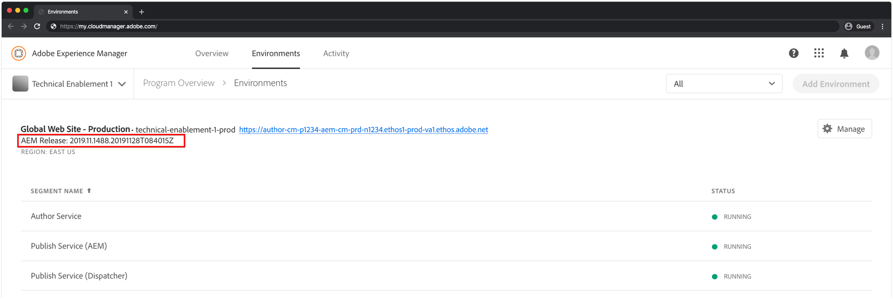

# Local Dispatcher Tools

Adobe Experience Manager (AEM)'s Dispatcher is a Apache HTTP Web server module that provides a security and performance layer between the CDN and AEM Publish tier. Dispatcher is an integral part of the overall Experience Manager architecture and should be part of local development set up.

The AEM as a Cloud Service SDK includes the recommended Dispatcher Tools version, that facilitates configuring, validating and simulating Dispatcher locally. Dispatcher Tools is comprised of:

+ a baseline set of Apache HTTP Web server and Dispatcher configuration files, located in `.../dispatcher-sdk-x.x.x/src`
+ a configuration validator CLI tool, located at `.../dispatcher-sdk-x.x.x/bin/validator`
+ a configuration deployment CLI tool, located at `.../dispatcher-sdk-x.x.x/bin/docker_run`
+ a Docker image that runs Apache HTTP Web server with the Dispatcher module

## Prerequisites

1. Install Experience Manager Publish QuickStart on the local develop machine.
   + Optionally, install the AEM reference web site on AEM Publish. This web site is used in this tutorial to visualize a working Dispatcher.
1. Install and start the latest version of [Docker](https://www.docker.com/) (v18.03+) on the local development machine.

## Download the Dispatcher Tools (as part of the AEM SDK)

The AEM as a Cloud Service SDK, or AEM SDK, contains the Dispatcher Tools used to run Apache HTTP Web server with the Dispatcher module locally for development, as well as the compatible Quickstart Jar.

If the AEM as a Cloud Service SDK has already been downloaded to [setup the local AEM runtime](./aem-runtime.md), it does not need to be re-downloaded.

1. Log in to [downloads.experiencecloud.adobe.com](http://downloads.experiencecloud.adobe.com/) with your Adobe ID.
1. Select the __General__ tab at the top
1. Select __Tooling__ from the __Type__ filter
1. Sort by __Published Date__ in __Descending__ order
1. Click on the latest __AEM SDK__ download row
1. Review and accept the EULA, and tap the __Download__ button



## Extract the Dispatcher Tools from the AEM SDK zip

Note that the version of Dispatcher Tools is different from that of the AEM SDK. As long as the version of Dispatcher Tools is provided via the AEM SDK version matching the AEM as a Cloud Service version.

1. Unzip the downloaded `aem-sdk-XXX.zip` file
1. Unpack the Dispatcher Tools into `~/aem-sdk/dispatcher`
   + Windows: Unzip `aem-sdk-dispatcher-tools-x.x.x-windows.zip`
   + macOS / Linux: Execute the accompanying shell script `aem-sdk-dispatcher-tools-x.x.x-unix.sh` to unpack the Dispatcher Tools
     + `$ chmod a+x aem-sdk-dispatcher-tools-x.x.x-unix.sh && ./aem-sdk-dispatcher-tools-x.x.x-unix.sh`

>[!VIDEO](https://video.tv.adobe.com/v/29937/?quality=12)

## Understand the Dispatcher configuration files

The Dispatcher Tools provides a set of Apache HTTP Web server and Dispatcher configuration files that define behavior for all environments, including local development.

These files are intended to be copied into an Experience Manager Maven project to the `dispatcher/src` folder, if they do not already exist in the Experience Manager Maven project.

>[!TIP]
> Experience Manager projects created from the [AEM Project Maven Archetype](https://github.com/adobe/aem-project-archetype) are pre-populated this set of Dispatcher configuration files, thus there is no need to copy over from the Dispatcher Tools src folder.

>[!VIDEO](https://video.tv.adobe.com/v/29959/?quality=12)

A complete description of the configuration files is available in the unpacked Dispatcher Tools as `dispatcher-sdk-x.x.x/docs/Config.html`.

## Run Dispatcher locally

To run the Dispatcher locally, the Dispatcher configuration files to be used to configure it, must be validated using the Dispatcher Tools's `validator` CLI tool.

+ Usage: `$ ./bin/validator full -d ./out ./src`

The validation is dual purpose:

+ Validates the Apache HTTP Web server and Dispatcher configuration files for correctness
+ Transpiles the configurations into a file-set compatible with the Docker container's Apache HTTP Web Server.

Once validated, the transpiled configurations are used run Dispatcher locally in the Docker container. It is important to ensure the latest configurations have been validated __and__ output using the validator's `-d` option.

+ Usage: `./bin/docker_run.sh deployment-folder aem-publish-host:aem-publish-port dispatcher-port`

The `aem-publish-host` can be set to `host.docker.internal`, a special DNS name Docker 18.03+ provides in the container that resolves to the host machine's IP.

For example to start the Dispatcher Docker container using the default configuration files provided by the Dispatcher Tools:

1. Generate the `deployment-folder`, named `out` by convention, from scratch every time a configuration changes:

   + `$ rm -rf ./out && ./bin/validator full -d ./out ./src`

2. (Re-)start Dispatcher Docker container providing the path to the deployment folder:

   + `$ ./bin/docker_run.sh ./out host.docker.internal:4503 8080`

The AEM as a Cloud Service SDK's Publish Service, running locally on port 4503 will be available through Dispatcher at `http://localhost:8080`.

To run Dispatcher Tools against an Experience Manager project's Dispatcher configuration, simply generate the `deployment-folder` using the project's `dispatcher/src` folder.

```
$ rm -rf ./out && ./bin/validator full -d ./out ~/code/my-project/dispatcher/src

$ ./bin/docker_run.sh ./out host.docker.internal:4503 8080
```

>[!VIDEO](https://video.tv.adobe.com/v/29960/?quality=12)

## Dispatcher Tools logs

Dispatcher logs are helpful during local development to understand if and why HTTP Requests are blocked. Log level can be set by prefixing the execution of `./bin/docker_run.sh` with environment parameters.

Dispatcher Tools logs are emitted to the standard out when `./bin/docker_run.sh` is run.

Useful parameters for debugging Dispatcher include:

+ `DISP_LOG_LEVEL=Debug` sets Dispatcher module logging to Debug level
  + Default value is: `Warn`
+ `REWRITE_LOG_LEVEL=Debug` sets Apache HTTP Web server rewrite module logging to Debug level
  + Default value is: `Warn`
+ `DISP_RUN_MODE` sets the "run mode" of the Dispatcher environment, loading the corresponding run modes Dispatcher configuration files.
  + Defaults to `dev`
+ Valid values: `dev`, `stage`, or `prod`

One or many parameters, can be passed to `docker_run.sh`

```{shell}
$ ./bin/validator full -d out ~/code/my-project/dispatcher/src

$ DISP_LOG_LEVEL=Debug REWRITE_LOG_LEVEL=Debug ./bin/docker_run.sh out host.docker.internal:4503 8080
```

>[!VIDEO](https://video.tv.adobe.com/v/29961/?quality=12)

## When to update Dispatcher Tools{#dispatcher-tools-version}

Dispatcher Tools versions increment less frequently than the Experience Manager, and thus Dispatcher Tools require fewer updates in the local development environment.

The recommended Dispatcher Tools version is that which is bundled with the AEM as a Cloud Service SDK that matches the Experience Manager as a Cloud Service version, which can be found at:

+ __Cloud Manager > Environments__, per environment specified by the __AEM Release__ label



_Note that Dispatcher Tools version itself will not match the Experience Manager version._

## Additional Resources

+ [Download AEM SDK](http://downloads.experiencecloud.adobe.com/)
+ [Adobe Cloud Manager](https://my.cloudmanager.adobe.com/)
+ [Download Docker](https://www.docker.com/)
+ [Experience Manager Dispatcher Documentation](https://docs.adobe.com/content/help/en/experience-manager-dispatcher/using/dispatcher.html)
