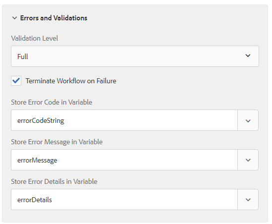

# Capturing Error Messages in Invoke Form Data Model Service Step
The following new features have been added to enhance Invoke Form Data Model Service Step in AEM Workflow

1. Providing an option for 3 tier validation  ("OFF" , "BASIC" and "FULL") to handle Exceptions as opposed to the present default configuration of "BASIC". The 3 options successively denote a stricter version of checking Database-specific requirements.

1. Providing a checkbox for customizing the execution of Workflow. You now have the option to continue with the workflow execution even if invoke FDM service step encounters an error.

2. Storing important information of Error messages. Three Autocomplete-type variable selectors have been incorporated to select relevant variables to store the ErrorCode(String),ErrorMessage(String) and ErrorDetails(Json). The ErrorMessage however would be set to NULL incase the exception is not a DermisValidationException

The error code  returned by the data source is wrapped by the form data model layer that in turns produces an error code of type string. For example if your data source returns error code 405, the value stored in the errorCode variable will not be 405, instead it will be internal FDM error code.
 
