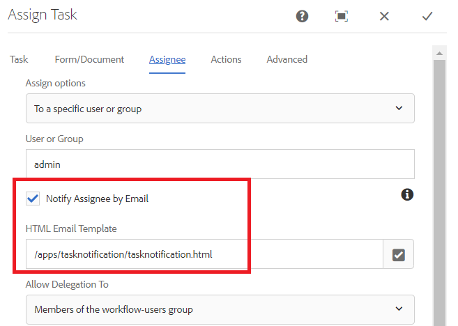
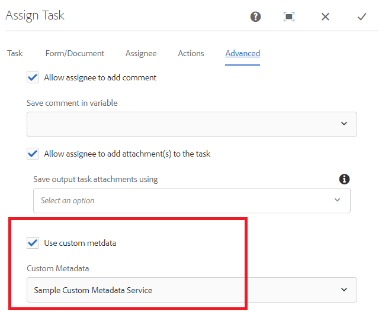
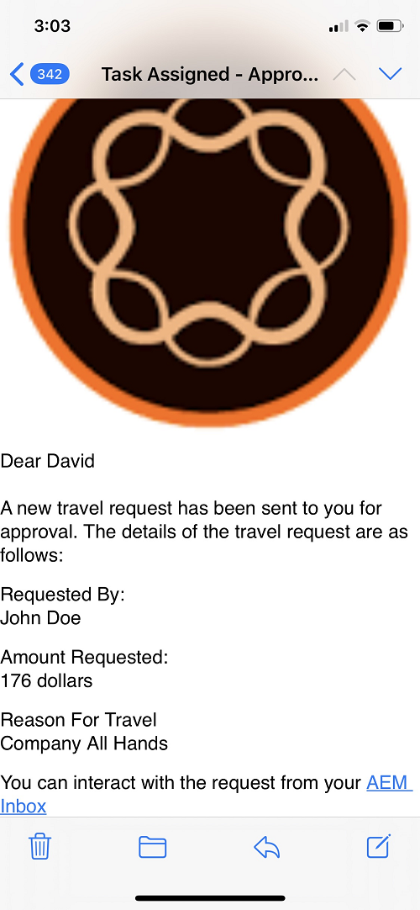

# Customize Assign Task Notification

Assign Task component is used to assign tasks to workflow participants. When a task is assigned to a user or a group a email notification is sent to the defined user or group members.
This e-mail notification will typically contain dynamic data related to the task. This dynamic data is fetched using the system generated [metadata properties](https://docs.adobe.com/content/help/en/experience-manager-65/forms/publish-process-aem-forms/use-metadata-in-email-notifications.html#using-system-generated-metadata-in-an-email-notification).
To include values from the submitted form data in the e-mail notification, we need to create custom metadata property and then use these custom metadata properties in the e-mail template


## Creating custom metadata property

The recommended approach is to create a OSGI component that implements the getUserMetadata method of the [WorkitemUserMetadataService](https://helpx.adobe.com/experience-manager/6-5/forms/javadocs/com/adobe/fd/workspace/service/external/WorkitemUserMetadataService.html#getUserMetadataMap--)

The following code creates 4 metadata properties(_firstName_,_lastName_,_reason_ and _amountRequested_) and sets its value from the submitted data. For example the metadata property _firstName_'s value is set to the value of the element called firstName from the submitted data.


``` java
package com.aemforms.workitemuserservice.core;

import java.io.InputStream;
import java.util.HashMap;
import java.util.Map;

import javax.jcr.Session;
import javax.xml.parsers.DocumentBuilder;
import javax.xml.parsers.DocumentBuilderFactory;
import javax.xml.xpath.XPath;

import org.osgi.framework.Constants;
import org.osgi.service.component.annotations.Component;
import org.slf4j.Logger;
import org.slf4j.LoggerFactory;
import org.w3c.dom.Document;

import com.adobe.fd.workspace.service.external.WorkitemUserMetadataService;
import com.adobe.granite.workflow.WorkflowSession;
import com.adobe.granite.workflow.exec.WorkItem;
import com.adobe.granite.workflow.metadata.MetaDataMap;
@Component(property={Constants.SERVICE_DESCRIPTION+"=A sample implementation of a user metadata service.",
Constants.SERVICE_VENDOR+"=Adobe Systems",
"process.label"+"=Sample Custom Metadata Service"})


public class WorkItemUserServiceImpl implements WorkitemUserMetadataService {
private static final Logger log = LoggerFactory.getLogger(WorkItemUserServiceImpl.class);

@Override
public Map<String, String> getUserMetadata(WorkItem workItem, WorkflowSession workflowSession,MetaDataMap metadataMap)
{
HashMap<String, String> customMetadataMap = new HashMap<String, String>();
String payloadPath = workItem.getWorkflowData().getPayload().toString();
String dataFilePath = payloadPath + "/Data.xml/jcr:content";
Session session = workflowSession.adaptTo(Session.class);
DocumentBuilderFactory factory = null;
DocumentBuilder builder = null;
Document xmlDocument = null;
javax.jcr.Node xmlDataNode = null;
try
{
    xmlDataNode = session.getNode(dataFilePath);
    InputStream xmlDataStream = xmlDataNode.getProperty("jcr:data").getBinary().getStream();
    XPath xPath = javax.xml.xpath.XPathFactory.newInstance().newXPath();
    factory = DocumentBuilderFactory.newInstance();
    builder = factory.newDocumentBuilder();
    xmlDocument = builder.parse(xmlDataStream);
    org.w3c.dom.Node firstNameNode = (org.w3c.dom.Node) xPath.compile("afData/afUnboundData/data/firstName")
            .evaluate(xmlDocument, javax.xml.xpath.XPathConstants.NODE);
    log.debug("The value of first name element  is " + firstNameNode.getTextContent());
    org.w3c.dom.Node lastNameNode = (org.w3c.dom.Node) xPath.compile("afData/afUnboundData/data/lastName")
            .evaluate(xmlDocument, javax.xml.xpath.XPathConstants.NODE);
    org.w3c.dom.Node amountRequested = (org.w3c.dom.Node) xPath
            .compile("afData/afUnboundData/data/amountRequested")
            .evaluate(xmlDocument, javax.xml.xpath.XPathConstants.NODE);
    org.w3c.dom.Node reason = (org.w3c.dom.Node) xPath.compile("afData/afUnboundData/data/reason")
            .evaluate(xmlDocument, javax.xml.xpath.XPathConstants.NODE);
    customMetadataMap.put("firstName", firstNameNode.getTextContent());
    customMetadataMap.put("lastName", lastNameNode.getTextContent());
    customMetadataMap.put("amountRequested", amountRequested.getTextContent());
    customMetadataMap.put("reason", reason.getTextContent());
    log.debug("Created  " + customMetadataMap.size() + " metadata  properties");

}
catch (Exception e)
{
    log.debug(e.getMessage());
}
return customMetadataMap;
}

}

```

## Use the custom metadata properties in task notification email template

In the email template you can include the metadata property by using the following syntax where amountRequested is the metadata property `${amountRequested}`

## Configure Assign Task to use custom metadata property

After the OSGi component is built and deployed into AEM server, configure the Assign Task component as shown below to use custom metadata properties.




Enable the use of custom metadata properties and select the appropriate OSGi component to use



To try this on your server

* Configure Day CQ Mail Service
* Associate a valid e-mail id with [admin user](http://localhost:4502/security/users.html)
* Download and install the [Workflow-and-notification-template](assets/workflow-and-task-notification-template.zip) using [package manager](http://localhost:4502/crx/packmgr/index.jsp)
* Download [Adaptive Form](assets/request-travel-authorization.zip) and import into AEM from the [forms and documents ui](http://localhost:4502/aem/forms.html/content/dam/formsanddocuments).
* Deploy and start the [Custom Bundle](assets/work-items-user-service-bundle.jar) using the [web console](http://localhost:4502/system/console/bundles)
* [Preview and submit the form](http://localhost:4502/content/dam/formsanddocuments/requestfortravelauhtorization/jcr:content?wcmmode=disabled)

On form submission task assignment notification is sent e-mail id associated with the admin user



>[!NOTE]
The email template for the assign task notification needs to be in the following format.
subject=Task Assigned - `${workitem_title}`
message=String representing your email template without any new line characters