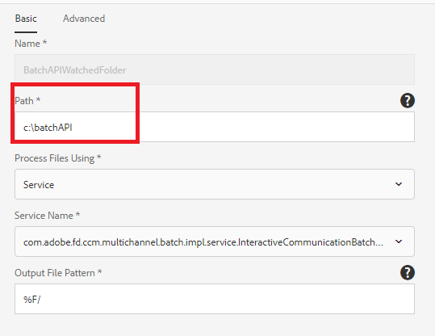

# Batch API

You can use the Batch API to produce multiple interactive communications from a template. The template is an interactive communication without any data. The Batch API combines data with a template to produce an interactive communication. The API is useful in the mass production of interactive communications. For example, telephone bills, credit card statements for multiple customers.

 [Learn more on Batch Generation API](https://docs.adobe.com/content/help/en/experience-manager-65/forms/interactive-communications/generate-multiple-interactive-communication-using-batch-api.html)

 This article will provide you with sample assets to generate Interactive Communications documents using Batch API

## Batch Generation using Watched Folder

Import the [Interactive Communication template](assets/Beneficiaries-confirmation.zip) into your AEM Forms server. 
Import the [watched folder configuration](assets/batch-generation-api.zip) This will create a folder called batchAPI in your c drive.

>[!NOTE]
if you are running AEM Forms on non-windows operating system [open watched folder](http://localhost:4502/libs/fd/core/WatchfolderUI/content/UI.html)
Select BatchAPIWatchedFolder and click Edit
Change the path to match your operating system

Download and extract the contents of [zip file](assets/jsonfile.zip). The zip file contains folder called jsonfile which contains beneficiaries.json file. This file has the data to generate 3 documents.

Drop the jsonfile folder into the input folder of your watched folder. 
Once the folder is picked up for processing, check the result folder of your watched folder. You should see 3 PDF files generated

