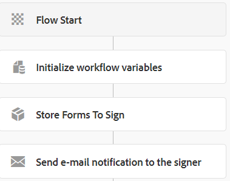

# create-main-workflow

The main workflow gets triggered when the user submits the **RefinanceForm**. The following is the flow of the workflow


Store Forms To Sign is custom process step.
The main reason for implementing custom process step is to extend an AEM Workflow. The following code was used to implement our custom process step. The code extracts the names of the forms to sign and passes the submitted form data to the insertData method the SignMultipleForms service. The insertData method then inserts the rows in the database identified by the data source **aemformstutorial**.

Code in this custom process step references the SignMultipleForms service.


```java
package com.aem.forms.signmultipleforms;

import java.io.ByteArrayInputStream;
import java.io.ByteArrayOutputStream;
import java.io.InputStream;
import java.io.StringWriter;
import java.nio.charset.Charset;
import java.nio.charset.StandardCharsets;

import javax.jcr.Node;
import javax.jcr.Session;
import javax.xml.parsers.DocumentBuilder;
import javax.xml.parsers.DocumentBuilderFactory;
import javax.xml.transform.TransformerFactory;
import javax.xml.transform.dom.DOMSource;
import javax.xml.transform.stream.StreamResult;
import javax.xml.xpath.XPath;

import org.apache.commons.io.IOUtils;
import org.osgi.framework.Constants;
import org.osgi.service.component.annotations.Component;
import org.osgi.service.component.annotations.Reference;
import org.slf4j.Logger;
import org.slf4j.LoggerFactory;
import org.w3c.dom.Document;

import com.adobe.granite.workflow.WorkflowException;
import com.adobe.granite.workflow.WorkflowSession;
import com.adobe.granite.workflow.exec.WorkItem;
import com.adobe.granite.workflow.exec.WorkflowProcess;
import com.adobe.granite.workflow.metadata.MetaDataMap;

@Component(property = {
  Constants.SERVICE_DESCRIPTION + "=StoreFormsToSign",
  Constants.SERVICE_VENDOR + "=Adobe Systems",
  "process.label" + "=StoreFormsToSign"
})
public class StoreFormsToSignWorkflowStep implements WorkflowProcess {
  private static final Logger log = LoggerFactory.getLogger(StoreFormsToSignWorkflowStep.class);@Reference
  SignMultipleForms signMultipleForms;

  @Override
  public void execute(WorkItem workItem, WorkflowSession workflowSession, MetaDataMap arg2) throws WorkflowException {
    String payloadPath = workItem.getWorkflowData().getPayload().toString();
    log.debug("The payload  in StoreFormsToSign " + workItem.getWorkflowData().getPayload().toString());
    String dataFilePath = payloadPath + "/Data.xml/jcr:content";
    String serverURL = arg2.get("PROCESS_ARGS", "string").toString();
    Session session = workflowSession.adaptTo(Session.class);
    DocumentBuilderFactory factory = null;
    DocumentBuilder builder = null;
    Document xmlDocument = null;
    Node xmlDataNode = null;
    try {
      xmlDataNode = session.getNode(dataFilePath);
      InputStream xmlDataStream = xmlDataNode.getProperty("jcr:data").getBinary().getStream();
      XPath xPath = javax.xml.xpath.XPathFactory.newInstance().newXPath();
      factory = DocumentBuilderFactory.newInstance();
      builder = factory.newDocumentBuilder();
      xmlDocument = builder.parse(xmlDataStream);
      org.w3c.dom.Node node = (org.w3c.dom.Node) xPath.compile("/afData/afUnboundData/data/formsToSign").evaluate(xmlDocument, javax.xml.xpath.XPathConstants.NODE);
      log.debug("The form names to sign are  t" + node.getTextContent());
      String formNamesToSign[] = node.getTextContent().split(",");
      ByteArrayOutputStream outputStream = new ByteArrayOutputStream();
      DOMSource source = new DOMSource(xmlDocument);
      StreamResult outputTarget = new StreamResult(outputStream);
      TransformerFactory.newInstance().newTransformer().transform(source, outputTarget);
      InputStream inputStream = new ByteArrayInputStream(outputStream.toByteArray());
      StringWriter writer = new StringWriter();
      IOUtils.copy(inputStream, writer, Charset.defaultCharset());
      String formData = writer.toString();
      signMultipleForms.insertData(formNamesToSign, formData, serverURL, workItem, workflowSession);

    }
    catch(Exception e) {
      log.debug(e.getMessage());
    }

  }
}

```


