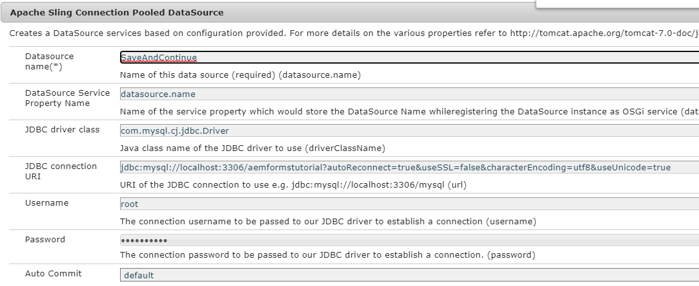

# Configure Data Source

There are many ways with which AEM enables integration with external database. One of the most common & standard practice of database integration is by using Apache Sling Connection Pooled DataSource configuration properties through the [configMgr](http://localhost:4502/system/console/configMgr).
The first step is to download and deploy the appropriate [My SQL drivers](https://mvnrepository.com/artifact/mysql/mysql-connector-java) in AEM.
Then set the Sling Connection Pooled DataSource properties. These properties are specific to your database. The following screenshot shows the settings used for this tutorial. The database schema is provided to you as part of this tutorial assets.

Database has one table called formdata with the 3 columns as shown in the screen-shot below
 